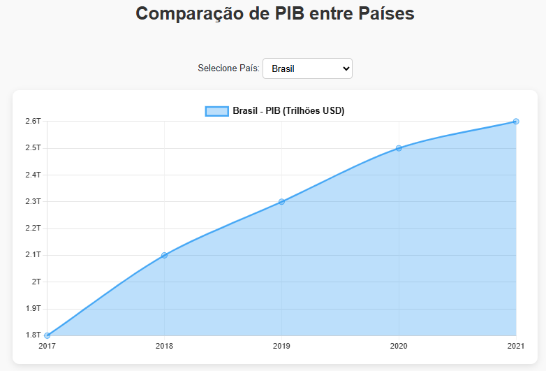
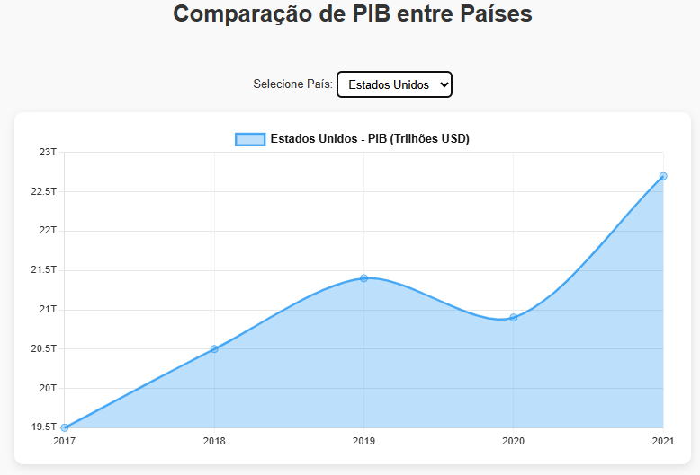
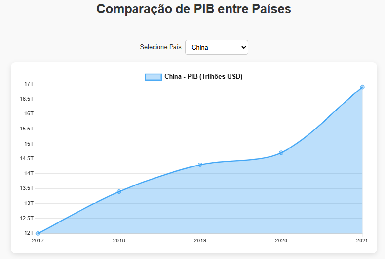
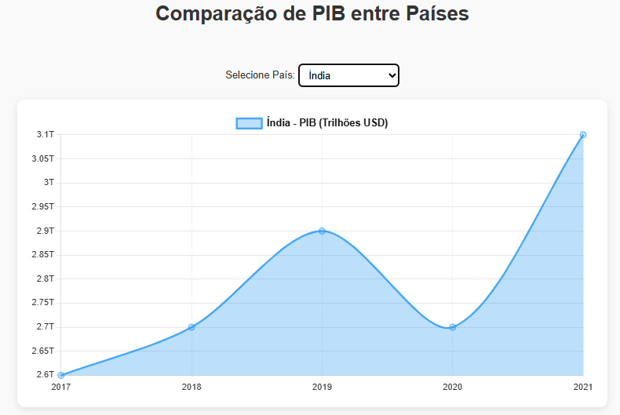

# 💹 Comparação de PIB entre Países

Este projeto apresenta um gráfico interativo que compara o Produto Interno Bruto (PIB) de países como Brasil, Estados Unidos, China e Índia ao longo dos anos. Através de uma interface simples e intuitiva, você pode selecionar diferentes países para visualizar suas evoluções econômicas.

---

## 🚀 Tecnologias Utilizadas

- **HTML5** – Estrutura da página  
- **CSS3** – Estilização responsiva e moderna  
- **JavaScript** – Manipulação dos dados e interatividade  
- **[Chart.js](https://www.chartjs.org/)** – Biblioteca para gráficos  

---

## 📊 Funcionalidades

- Gráfico de linha dinâmico com dados de PIB por ano  
- Seleção de país para comparação  
- Interface limpa, responsiva e fácil de usar  

---

## 🖼️ Demonstração

### Brasil  

### Estados Unidos  

### China  

### Índia  

---

## 📁 Estrutura do Projeto

🙋‍♂️ Autor
Desenvolvido por Eduardo Martins
🔗 GitHub: https://github.com/Eduuh007
🔗 LinkedIn: https://www.linkedin.com/in/eduardo-martins-575521245